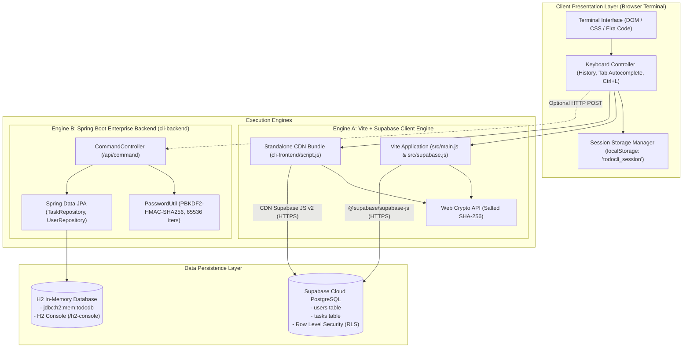
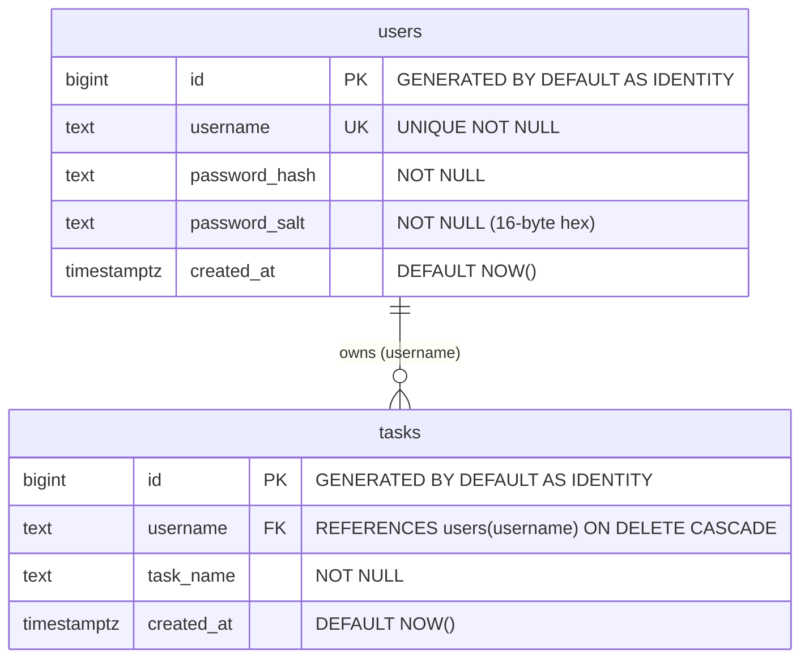
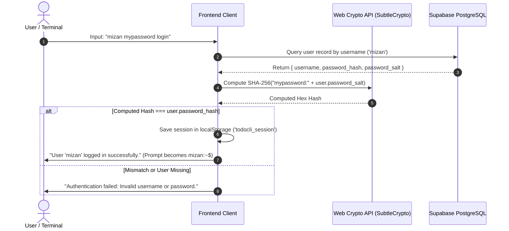
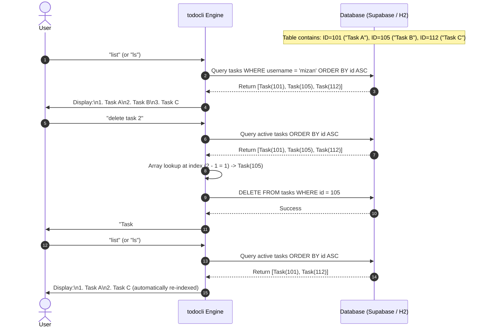
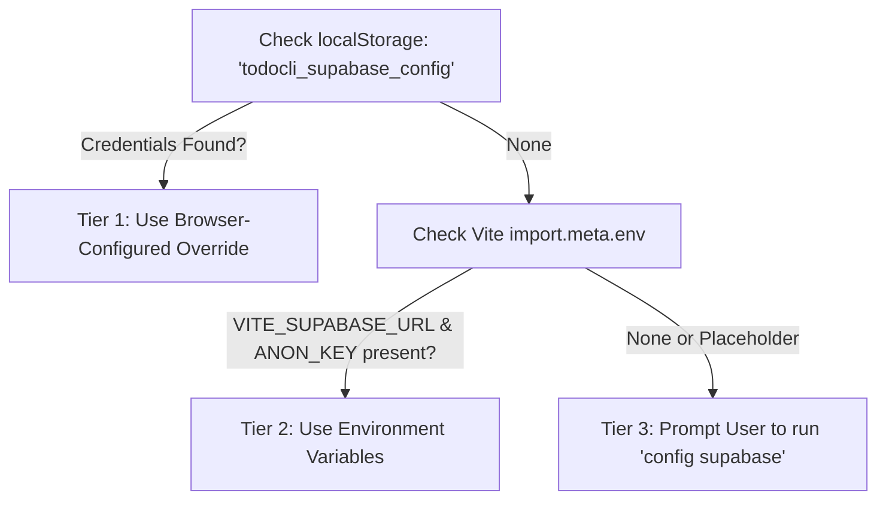

# todocli — Complete Technical Architecture & System Documentation

Welcome to the comprehensive, deep-dive technical documentation for **`todocli`**. This document provides an exhaustive, visual, and architectural breakdown of every component, algorithm, database schema, command grammar, and execution flow across the entire repository.

---

## 📑 Table of Contents

1. [System Overview & Architectural Philosophy](#1-system-overview--architectural-philosophy)
2. [Dual-Engine Architecture Model](#2-dual-engine-architecture-model)
3. [Repository Topology & File Catalog](#3-repository-topology--file-catalog)
4. [Database Architecture & Entity Schemas](#4-database-architecture--entity-schemas)
5. [Security, Cryptography & Authentication Model](#5-security-cryptography--authentication-model)
6. [CLI Grammar & Command Execution Pipeline](#6-cli-grammar--command-execution-pipeline)
7. [Frontend Engine & Authentic Terminal UX](#7-frontend-engine--authentic-terminal-ux)
8. [Backend Engine (`cli-backend`) & Spring Boot API](#8-backend-engine-cli-backend--spring-boot-api)
9. [Task Serial Number Mapping & Deletion Algorithm](#9-task-serial-number-mapping--deletion-algorithm)
10. [Configuration Management & Deployment Topology](#10-configuration-management--deployment-topology)
11. [Verification & Automated Test Suite](#11-verification--automated-test-suite)

---

## 1. System Overview & Architectural Philosophy

**`todocli`** is a high-fidelity, web-based Unix-style command-line interface (CLI) to-do management platform. It allows users to interact with their task management system entirely via terminal commands typed directly into a browser-based terminal prompt (`username:~$`).

```
  _            _            _ _ 
 | |_ ___   __| | ___   ___| (_)
 | __/ _ \ / _` |/ _ \ / __| | |
 | || (_) | (_| | (_) | (__| | |
  \__\___/ \__,_|\___/ \___|_|_|
```

### Core Design Principles

1. **Zero Local Data Hoarding (Cloud-First Persistence)**:
   - User profiles and tasks are **never** stored in browser storage (`localStorage` or `IndexedDB`).
   - Every read, insertion, and deletion executes directly against a remote cloud database (Supabase PostgreSQL) or in-memory backend database (H2).
   - If a user changes machines or opens another browser, their tasks remain securely synced in the cloud.

2. **Ephemeral Client-Side Session Persistence**:
   - The browser's local storage is reserved exclusively for the active session object (`todocli_session`) when a user logs in via `<username> <password> login`.
   - Logging out (`logout`) purges this token immediately, returning the prompt to `todocli:~$`.

3. **Authentic Unix Terminal Ergonomics**:
   - Dynamic prompt prefix (`username:~$`).
   - Command history navigation with `ArrowUp` and `ArrowDown` (buffer capped at 100 items).
   - Contextual `Tab` autocompletion for commands and operations.
   - Screen clearing with `clear`, `cls`, or `Ctrl + L`.
   - Focus traps ensuring keyboard focus remains locked to the active CLI input line.

4. **Dual Interface Compatibility (`list` & `ls`)**:
   - Unix standard aliases are supported natively (`list` and `ls` are 100% interchangeable across both frontend and backend engines).

---

## 2. Dual-Engine Architecture Model

The `todocli` repository provides two operational architectures:
1. **The Modern Cloud Serverless Engine (Vite + Supabase)**: The primary web-native architecture where the client communicates directly with a cloud-hosted Supabase PostgreSQL instance via HTTPS/REST using the `@supabase/supabase-js` client and browser Web Crypto API.
2. **The Java Spring Boot Enterprise Engine (`cli-backend`)**: A standalone REST API built on Spring Boot 3.3.4, Spring Data JPA, and an in-memory H2 database, providing a stateless `/api/command` endpoint with PBKDF2 password hashing.

### High-Level System Architecture Diagram



### Engine Architectural Comparison Matrix

| Feature | Engine A: Supabase Cloud Engine | Engine B: Spring Boot H2 Engine |
| :--- | :--- | :--- |
| **Primary Location** | [`src/`](file:///c:/Users/mizan/Desktop/todocli/src) & [`cli-frontend/`](file:///c:/Users/mizan/Desktop/todocli/cli-frontend) | [`cli-backend/`](file:///c:/Users/mizan/Desktop/todocli/cli-backend) |
| **Technology Stack** | Vanilla JS (ES Modules) / Vite / Supabase JS v2 | Java 17 / Spring Boot 3.3.4 / Spring Data JPA |
| **Database** | Remote Cloud PostgreSQL (Supabase) | Embedded In-Memory H2 Database (`jdbc:h2:mem:tododb`) |
| **Data Durability** | Persistent across restarts, devices, and sessions | Ephemeral (resets on application JVM termination) |
| **Password Hashing** | Browser Web Crypto API (Salted SHA-256, 16-byte hex salt) | PBKDF2 with HMAC-SHA256 (65,536 iterations, 256-bit key) |
| **Communication** | Direct client-to-database via Supabase PostgREST | HTTP REST API (`POST /api/command`) |
| **Hosting Target** | Vercel, Netlify, GitHub Pages, Cloudflare Pages | Docker container, AWS EC2, Heroku, Local JVM |

---

## 3. Repository Topology & File Catalog

```
todocli/
├── .env                                       # Local Vite environment variables (Supabase URL & Key)
├── .env.example                               # Template for Supabase credentials configuration
├── .gitignore                                 # Git exclusion rules (node_modules, dist, target, etc.)
├── index.html                                 # Root HTML page for Vite development server & production build
├── package.json                               # npm project definition (Vite, @supabase/supabase-js)
├── package-lock.json                          # Exact dependency lockfile
├── README.md                                  # Repository introductory guide and command quick-reference
├── vercel.json                                # Vercel deployment configuration & SPA URL rewrite rules
├── DOCUMENTATION.md                           # This comprehensive technical architecture document
│
├── public/                                    # Static public assets
│   ├── favicon.svg                            # Terminal-style application favicon
│   └── icons.svg                              # SVG sprite / symbol definitions
│
├── src/                                       # Primary Vite Frontend Source Code
│   ├── main.js                                # Terminal UI controller, keybindings, command dispatcher
│   ├── supabase.js                            # Supabase client factory, queries, WebCrypto password hasher
│   ├── style.css                              # Authentic dark monospace terminal stylesheet
│   ├── counter.js                             # Vite scaffold demo module
│   └── assets/                                # Frontend graphic assets
│       ├── hero.png                           # CLI terminal banner graphic
│       ├── javascript.svg                     # JavaScript technology logo
│       └── vite.svg                           # Vite build tool logo
│
├── cli-frontend/                              # Standalone Zero-Build CDN Web Distribution
│   ├── index.html                             # Standalone HTML entry loading Supabase from jsDelivr CDN
│   ├── script.js                              # Self-contained terminal controller with inline WebCrypto
│   └── style.css                              # Monospace terminal stylesheet
│
├── cli-backend/                               # Standalone Java Spring Boot Enterprise Application
│   ├── pom.xml                                # Maven project object model (Spring Boot 3.3.4, JPA, H2)
│   └── src/
│       ├── main/
│       │   ├── java/com/example/cli/
│       │   │   ├── CliApplication.java        # Spring Boot entry point with CLI banner output
│       │   │   ├── controller/
│       │   │   │   └── CommandController.java # Unified /api/command REST endpoint & command interpreter
│       │   │   ├── model/
│       │   │   │   ├── Task.java              # JPA Entity representing a user's task
│       │   │   │   └── User.java              # JPA Entity representing a registered user account
│       │   │   ├── repository/
│       │   │   │   ├── TaskRepository.java    # Spring Data JPA repository with deterministic sorting
│       │   │   │   └── UserRepository.java    # Spring Data JPA repository for user lookup
│       │   │   └── util/
│       │   │       └── PasswordUtil.java      # Cryptographic PBKDF2 hashing & constant-time verification
│       │   └── resources/
│       │       └── application.properties     # Spring Boot application & H2 database configuration
│       └── test/
│           └── java/com/example/cli/
│               └── CommandControllerTest.java # Full integration test suite (auth, CRUD, list/ls alias)
│
└── supabase/
    └── schema.sql                             # PostgreSQL DDL script (tables, indexes, RLS security policies)
```

---

## 4. Database Architecture & Entity Schemas

### 4.1 Supabase Cloud PostgreSQL Schema (`supabase/schema.sql`)

The cloud database runs PostgreSQL 15+ hosted on Supabase. It uses a relational model between `users` and `tasks` with foreign key cascade deletion.



#### SQL Schema Definition

```sql
-- 1. Users Table
CREATE TABLE IF NOT EXISTS users (
    id BIGINT GENERATED BY DEFAULT AS IDENTITY PRIMARY KEY,
    username TEXT UNIQUE NOT NULL,
    password_hash TEXT NOT NULL,
    password_salt TEXT NOT NULL,
    created_at TIMESTAMPTZ DEFAULT NOW()
);

-- 2. Tasks Table
CREATE TABLE IF NOT EXISTS tasks (
    id BIGINT GENERATED BY DEFAULT AS IDENTITY PRIMARY KEY,
    username TEXT NOT NULL REFERENCES users(username) ON DELETE CASCADE,
    task_name TEXT NOT NULL,
    created_at TIMESTAMPTZ DEFAULT NOW()
);

-- 3. High-Performance Deterministic Indexes
CREATE INDEX IF NOT EXISTS idx_tasks_username_id ON tasks(username, id ASC);
CREATE INDEX IF NOT EXISTS idx_users_username ON users(username);

-- 4. Row Level Security (RLS)
ALTER TABLE users ENABLE ROW LEVEL SECURITY;
ALTER TABLE tasks ENABLE ROW LEVEL SECURITY;

-- 5. Open Anonymous Client Access Policies
CREATE POLICY "Allow public select users" ON users FOR SELECT USING (true);
CREATE POLICY "Allow public insert users" ON users FOR INSERT WITH CHECK (true);
CREATE POLICY "Allow public select tasks" ON tasks FOR SELECT USING (true);
CREATE POLICY "Allow public insert tasks" ON tasks FOR INSERT WITH CHECK (true);
CREATE POLICY "Allow public delete tasks" ON tasks FOR DELETE USING (true);
CREATE POLICY "Allow public update tasks" ON tasks FOR UPDATE USING (true);
```

> [!NOTE]
> The compound index `idx_tasks_username_id ON tasks(username, id ASC)` is critical. It guarantees that task queries for a specific user are returned in consistent ascending ID order with $O(\log N)$ index seek performance, ensuring stable 1-based serial numbering.

---

### 4.2 Spring Boot JPA Entity Model (`cli-backend`)

In the Java backend, the schema is mapped via Jakarta Persistence annotations (`jakarta.persistence.*`) targeting an in-memory H2 database.

#### `User.java`
```java
@Entity
@Table(name = "users")
public class User {
    @Id
    @GeneratedValue(strategy = GenerationType.IDENTITY)
    private Long id;

    @Column(unique = true, nullable = false)
    private String username;

    @Column(nullable = false)
    private String passwordHash;

    @Column(nullable = false)
    private String passwordSalt;

    private LocalDateTime createdAt = LocalDateTime.now();
    // Constructors, Getters & Setters
}
```

#### `Task.java`
```java
@Entity
@Table(name = "tasks")
public class Task {
    @Id
    @GeneratedValue(strategy = GenerationType.IDENTITY)
    private Long id;

    private String username;
    private String taskName;
    private boolean completed = false;
    private LocalDateTime createdAt = LocalDateTime.now();
    // Constructors, Getters & Setters
}
```

---

## 5. Security, Cryptography & Authentication Model

Neither engine ever stores or transmits passwords in plaintext. Every password undergoes cryptographic salting and hashing before comparison or database insertion.

### 5.1 Frontend Web Crypto Hashing Model (`src/supabase.js` & `cli-frontend/script.js`)

In the browser client, cryptographic routines utilize the native, hardware-accelerated **Web Crypto API** (`window.crypto.subtle`).



#### Code Implementation:
```javascript
// Salt Generation: 16 cryptographically random bytes formatted as a 32-character hex string
export function generateHexSalt() {
  const bytes = new Uint8Array(16);
  crypto.getRandomValues(bytes);
  return Array.from(bytes).map(b => b.toString(16).padStart(2, '0')).join('');
}

// Salted SHA-256 Hashing via Web Crypto API
export async function hashPassword(password, hexSalt) {
  const encoder = new TextEncoder();
  const data = encoder.encode(password + ':' + hexSalt);
  const hashBuffer = await crypto.subtle.digest('SHA-256', data);
  const hashArray = Array.from(new Uint8Array(hashBuffer));
  return hashArray.map(b => b.toString(16).padStart(2, '0')).join('');
}
```

---

### 5.2 Java Enterprise PBKDF2 Model (`cli-backend/src/main/java/com/example/cli/util/PasswordUtil.java`)

In the Java backend, authentication uses the **PBKDF2WithHmacSHA256** key derivation function, providing resistance against brute-force and GPU rainbow table attacks.

```java
public final class PasswordUtil {
    private static final int ITERATIONS = 65536;
    private static final int KEY_LENGTH = 256;
    private static final int SALT_BYTES = 16;
    private static final SecureRandom SECURE_RANDOM = new SecureRandom();

    public static String generateSalt() {
        byte[] salt = new byte[SALT_BYTES];
        SECURE_RANDOM.nextBytes(salt);
        return HexFormat.of().formatHex(salt);
    }

    public static String hashPassword(String password, String hexSalt) {
        try {
            byte[] salt = HexFormat.of().parseHex(hexSalt);
            PBEKeySpec spec = new PBEKeySpec(password.toCharArray(), salt, ITERATIONS, KEY_LENGTH);
            SecretKeyFactory skf = SecretKeyFactory.getInstance("PBKDF2WithHmacSHA256");
            byte[] hash = skf.generateSecret(spec).getEncoded();
            return HexFormat.of().formatHex(hash);
        } catch (NoSuchAlgorithmException | InvalidKeySpecException e) {
            throw new IllegalStateException("Error hashing password with PBKDF2", e);
        }
    }

    // Constant-time equality check prevents side-channel timing attacks
    public static boolean verifyPassword(String password, String hexSalt, String expectedHexHash) {
        if (password == null || hexSalt == null || expectedHexHash == null) {
            return false;
        }
        String computedHex = hashPassword(password, hexSalt);
        byte[] a = HexFormat.of().parseHex(computedHex);
        byte[] b = HexFormat.of().parseHex(expectedHexHash);
        return MessageDigest.isEqual(a, b);
    }
}
```

---

## 6. CLI Grammar & Command Execution Pipeline

### 6.1 Grammar Specification

Commands adhere to a deterministic token format:

```ebnf
CommandLine     ::= UtilityCommand | ExplicitCommand | ShortcutCommand ;

UtilityCommand  ::= "help" | "clear" | "cls" | "whoami" | SupabaseConfig ;
SupabaseConfig  ::= "config supabase" ( "status" | "clear" | ( <url> <anon_key> ) ) ;

ExplicitCommand ::= <username> <password> Operation ;
ShortcutCommand ::= ( "list" | "ls" | "add task " <task_name> | "delete task " <task_number> | "logout" ) ;

Operation       ::= "create"
                  | "login"
                  | "logout"
                  | ( "list" | "ls" )
                  | "add" "task" <task_name>
                  | "delete" "task" <task_number> ;
```

---

### 6.2 Complete Command Reference Table

| Command Syntax | Authentication Required | Description | Example Usage |
| :--- | :---: | :--- | :--- |
| `<user> <pass> create` | No | Creates a new account with a unique username and salted hash | `mizan secret123 create` |
| `<user> <pass> login` | No (Validates) | Authenticates credentials and stores session in browser `localStorage` | `mizan secret123 login` |
| `<user> <pass> logout` | Yes | Validates credentials and removes session from `localStorage` | `mizan secret123 logout` |
| `<user> <pass> list` | Yes | Retrieves all tasks owned by user, sorted by ID ascending | `mizan secret123 list` |
| `<user> <pass> ls` | Yes | **Exact alias for `list`** (Unix shortcut) | `mizan secret123 ls` |
| `<user> <pass> add task <name>` | Yes | Inserts a new task associated with the authenticated user | `mizan secret123 add task Buy groceries` |
| `<user> <pass> delete task <num>` | Yes | Resolves 1-based display serial number `<num>` to database task and deletes it | `mizan secret123 delete task 2` |
| **Logged-In Shortcuts** | | *(Available when session active in browser)* | |
| `list` | Automatic | Lists active user's tasks with 1-based serial numbers | `list` |
| `ls` | Automatic | **Exact alias for `list`** | `ls` |
| `add task <name>` | Automatic | Adds a task for the currently logged-in user | `add task Review PR` |
| `delete task <num>` | Automatic | Deletes a task by serial number for logged-in user | `delete task 1` |
| `whoami` | None | Displays current logged-in username or unauthenticated notice | `whoami` |
| `logout` | Automatic | Clears current session from `localStorage` and resets prompt | `logout` |
| **System Utilities** | | | |
| `config supabase <url> <key>` | None | Persists custom Supabase credentials directly in browser storage | `config supabase https://xyz.supabase.co eyJhb...` |
| `config supabase status` | None | Shows active Supabase connection status with masked anon key | `config supabase status` |
| `config supabase clear` | None | Wipes browser-stored Supabase credentials | `config supabase clear` |
| `clear` / `cls` | None | Instantly empties the terminal output viewport | `clear` |
| `help` | None | Prints the complete built-in command reference guide | `help` |

---

### 6.3 Command Processing & Dispatch Flowchart

```mermaid
flowchart TD
    Start([User presses Enter in CLI Input]) --> Trim[Trim input string]
    Trim --> EmptyCheck{Is input empty?}
    EmptyCheck -- Yes --> End([Do nothing])
    EmptyCheck -- No --> PushHistory[Push to commandHistory buffer & localStorage]
    PushHistory --> ClearInput[Clear input line element]
    ClearInput --> CheckGlobal{Command in ['clear', 'cls']?}
    
    CheckGlobal -- Yes --> ClearTerminal[Wipe terminal-history innerHTML] --> End
    CheckGlobal -- No --> CheckHelp{Command == 'help'?}
    
    CheckHelp -- Yes --> RenderHelp[Append Help Manual to Terminal] --> End
    CheckHelp -- No --> CheckWhoami{Command == 'whoami'?}
    
    CheckWhoami -- Yes --> RenderWhoami[Display active user or 'Not logged in'] --> End
    CheckWhoami -- No --> CheckConfig{Starts with 'config supabase'?}
    
    CheckConfig -- Yes --> ExecConfig[Execute Supabase Config Handler] --> End
    CheckConfig -- No --> CheckShortcut{First token in ['list','ls','add','delete','logout']?}
    
    CheckShortcut -- Yes --> HasSession{Is user logged in?}
    HasSession -- No --> ShowAuthErr["Error: Invalid command format. Log in first."] --> End
    HasSession -- Yes --> ExpandShortcut["Expand: ${session.username} ${session.password} ${command}"] --> ExecDB
    
    CheckShortcut -- No --> ParseParts{Parts count >= 3?}
    ParseParts -- No --> ShowSyntaxErr["Error: Must start with <username> <password> <operation>"] --> End
    ParseParts -- Yes --> ExecDB[Execute Database Command Dispatcher]

    ExecDB --> AuthCheck{Authenticate Credentials}
    AuthCheck -- Failed --> AuthFail["Authentication failed: Invalid username or password."] --> End
    AuthCheck -- Success --> OpSwitch{Switch on operation}

    OpSwitch -- "create" --> OpCreate[Insert User with Salted Hash]
    OpSwitch -- "login" --> OpLogin[Save Session & Set Prompt]
    OpSwitch -- "logout" --> OpLogout[Clear Session & Reset Prompt]
    OpSwitch -- "list" or "ls" --> OpList[Fetch Tasks by ID ASC & Format 1..N]
    OpSwitch -- "add" --> OpAdd[Validate 'task' keyword & Insert Task]
    OpSwitch -- "delete" --> OpDelete[Validate 'task' keyword, resolve serial to ID & Delete]
    OpSwitch -- Default --> OpUnknown["Error: Unknown operation. Type 'help'"]

    OpCreate --> RenderResult[Append Result Entry to Terminal DOM]
    OpLogin --> RenderResult
    OpLogout --> RenderResult
    OpList --> RenderResult
    OpAdd --> RenderResult
    OpDelete --> RenderResult
    OpUnknown --> RenderResult
    RenderResult --> Scroll[Scroll terminal to bottom] --> End
```

---

## 7. Frontend Engine & Authentic Terminal UX

The frontend interface is rendered via vanilla HTML5, CSS3, and JavaScript, designed to replicate an authentic Unix terminal environment.

### 7.1 Keybinding Controller

| Key Combination | Action Handler | Behavior |
| :--- | :--- | :--- |
| `Enter` | `executeCommand()` | Dispatches the command string through the parser and execution engine. |
| `ArrowUp` | History Backwards | Navigates backwards through previously executed commands (`commandHistory`). |
| `ArrowDown` | History Forwards | Navigates forward through history, returning to blank input at index -1. |
| `Tab` | `handleAutocomplete()` | Autocompletes commands matching available keywords depending on login state. |
| `Ctrl + L` | Screen Clear | Clears all DOM child nodes inside `#terminal-history`. |
| Any Click | Document Click Listener | Automatically refocuses `#cli-input` to ensure uninterrupted typing. |

#### Autocomplete Code Snippet (`src/main.js` & `cli-frontend/script.js`):
```javascript
function handleAutocomplete() {
  const val = cliInput.value.trim().toLowerCase();
  if (!val) return;

  const session = getSession();
  const available = session
    ? ['help', 'clear', 'cls', 'list', 'ls', 'add task ', 'delete task ', 'logout', 'whoami', 'config supabase ']
    : ['help', 'clear', 'cls', 'create', 'login', 'logout', 'list', 'ls', 'add task ', 'delete task ', 'config supabase '];

  const match = available.find(c => c.startsWith(val));
  if (match) {
    cliInput.value = match;
  }
}
```

---

### 7.2 Monospace Terminal Styling System (`src/style.css`)

```css
/* Core Terminal Aesthetics */
html, body {
  background-color: #000000;
  color: #e5e7eb;
  font-family: 'Fira Code', 'Cascadia Code', Consolas, 'Courier New', monospace;
  font-size: 15px;
  line-height: 1.5;
}

/* Prompt and Brand Coloring */
.prompt-user, .history-prompt {
  color: #10b981; /* Emerald-500 */
  font-weight: 600;
}

.history-output.error {
  color: #f87171; /* Red-400 */
}

.history-output.success {
  color: #34d399; /* Emerald-400 */
}

/* Masked Input Display Architecture */
.cli-input-wrapper {
  position: relative;
  flex: 1;
  min-width: 0;
  display: flex;
  align-items: center;
}

.cli-input-display {
  position: absolute;
  top: 0;
  left: 0;
  width: 100%;
  height: 100%;
  pointer-events: none;
  white-space: pre;
  overflow: hidden;
  color: #ffffff;
  font-family: inherit;
  font-size: inherit;
  line-height: inherit;
  display: flex;
  align-items: center;
  user-select: none;
}

.cli-input {
  width: 100%;
  background: transparent;
  border: none;
  outline: none;
  color: transparent; /* Native text hidden while preserving caret */
  caret-color: #10b981;
  font-family: inherit;
  font-size: inherit;
  line-height: inherit;
  padding: 0;
  margin: 0;
}

.cli-input::selection {
  background: rgba(16, 185, 129, 0.35);
}
```

---

### 7.3 Real-Time Visual Password Masking Engine

To prevent credential exposure in shared or recorded environments, `todocli` features an overlay-based real-time visual masking system.

#### Mechanism:
1. **Underlying Native `<input>`**: Captures keystrokes, clipboard paste, undo/redo, and native cursor movement. Its text is rendered transparent (`color: transparent`) while keeping the blinking caret visible (`caret-color: #10b981`).
2. **Synchronized Overlay (`.cli-input-display`)**: Renders on the exact same coordinate plane using identical monospace font metrics (`Fira Code`).
3. **Deterministic Token Masker (`maskCommand`)**: Detects when the first token represents a username (i.e. not a reserved utility/shortcut keyword). As the user types the second token (the password), it is dynamically replaced with an equal count of asterisk characters (`*`).
4. **History Log Masking**: Submitted commands appended to `#terminal-history` also pass through `maskCommand()`, ensuring passwords are never stored in the terminal viewport in plaintext.

```javascript
const NON_CREDENTIAL_COMMANDS = new Set([
  'help', 'clear', 'cls', 'whoami', 'config', 'supabase', 'list', 'ls', 'add', 'delete', 'logout'
]);

function maskCommand(raw) {
  if (!raw) return '';
  const match = raw.match(/^(\s*)(\S+)(\s+)(\S+)(.*)$/);
  if (!match) return raw;

  const [, leading, firstToken, sep, secondToken, rest] = match;
  if (NON_CREDENTIAL_COMMANDS.has(firstToken.toLowerCase())) {
    return raw;
  }

  return leading + firstToken + sep + '*'.repeat(secondToken.length) + rest;
}
```

---

## 8. Backend Engine (`cli-backend`) & Spring Boot API

The Java backend (`cli-backend`) provides a standalone REST API server.

### 8.1 REST API Endpoint Contract

#### Request (`POST /api/command`)
```json
{
  "command": "mizan mypassword list",
  "username": "mizan"
}
```

#### Response (`200 OK`)
```json
{
  "success": true,
  "output": "1. Finish the project documentation\n2. Study COLMAP\n3. Buy groceries",
  "tasks": [
    {
      "id": 1,
      "username": "mizan",
      "taskName": "Finish the project documentation",
      "completed": false,
      "createdAt": "2026-09-26T12:00:00"
    }
  ]
}
```

---

### 8.2 Unified Operation Dispatcher (`CommandController.java`)

Here is the exact operation dispatcher supporting both `list` and `ls`:

```java
switch (operation) {
    case "login":
        return ResponseEntity.ok(new CommandResponse(true,
                "User '" + username + "' logged in successfully.", null));

    case "logout":
        return ResponseEntity.ok(new CommandResponse(true,
                "User '" + username + "' logged out successfully.", null));

    case "list":
    case "ls":
        List<Task> tasks = taskRepository.findByUsernameOrderByIdAsc(username);
        if (tasks.isEmpty()) {
            return ResponseEntity.ok(new CommandResponse(true,
                    "No tasks found for user '" + username + "'.", tasks));
        }

        StringBuilder sb = new StringBuilder();
        for (int i = 0; i < tasks.size(); i++) {
            Task t = tasks.get(i);
            sb.append(String.format("%d. %s", i + 1, t.getTaskName()));
            if (i < tasks.size() - 1) {
                sb.append("\n");
            }
        }
        return ResponseEntity.ok(new CommandResponse(true, sb.toString(), tasks));

    case "add":
        // Validates sub-command 'task' and adds to taskRepository...
        // ...
    case "delete":
        // Validates sub-command 'task', maps serial number, deletes from taskRepository...
        // ...
    default:
        return ResponseEntity.ok(new CommandResponse(false,
                "Error: Unknown operation '" + operation + "'. Allowed operations: create, login, logout, list, ls, add task, delete task. Type 'help' for usage.",
                null));
}
```

---

## 9. Task Serial Number Mapping & Deletion Algorithm

A critical architectural feature of `todocli` is the distinction between **Internal Database Primary Keys** (`id: BIGINT`) and **Human-Facing Display Serial Numbers** (`1, 2, 3...`).

Users never see or type internal database IDs. Instead:
1. When tasks are retrieved via `list` or `ls`, they are deterministically ordered by `id ASC`.
2. The UI outputs each item with a 1-based index $i \in [1, N]$.
3. When the user executes `delete task 2`, the engine maps $2$ to index $2 - 1 = 1$ in the sorted array, locates the specific entity's primary key (`targetTask.id`), and executes deletion.
4. Subsequent calls to `list` or `ls` automatically recalculate 1-based serials for remaining tasks.



---

## 10. Configuration Management & Deployment Topology

### 10.1 Supabase Configuration Precedence

The application determines active Supabase credentials using a strict three-tier cascade:



#### In-Terminal Dynamic Configuration
Users can connect to any Supabase instance on-the-fly without rebuilding or editing environment variables:
```bash
# Connect to project
config supabase https://xyzcompany.supabase.co eyJhbGciOiJIUzI1NiIsInR5cCI6IkpXVCJ9...

# Inspect connection
config supabase status

# Wipe browser-stored credentials
config supabase clear
```

---

### 10.2 Production Build & Vercel Deployment

#### Build Command
```bash
npm run build
```
Vite compiles and minifies all assets into the `dist/` directory.

#### Vercel Configuration (`vercel.json`)
```json
{
  "buildCommand": "npm run build",
  "outputDirectory": "dist",
  "framework": "vite",
  "rewrites": [
    { "source": "/(.*)", "destination": "/index.html" }
  ]
}
```
This guarantees that all route requests are served by `index.html` as a Single Page Application (SPA).

---

## 11. Verification & Automated Test Suite

The Java backend contains a comprehensive JUnit 5 integration test suite in [`CommandControllerTest.java`](file:///c:/Users/mizan/Desktop/todocli/cli-backend/src/test/java/com/example/cli/CommandControllerTest.java).

### Verified Test Cases

| Test Method | Validation Scope |
| :--- | :--- |
| `testPasswordUtil()` | Validates 16-byte salt generation, PBKDF2 hashing, and constant-time verification. |
| `testHelpAndClear()` | Verifies that `help` prints the syntax manual and `clear` returns empty output. |
| `testUserCreation()` | Tests user registration, duplicate prevention, and verifies that plaintext passwords are never stored. |
| `testAuthenticationFailures()` | Validates error handling for unknown usernames and incorrect passwords. |
| `testLoginAndLogoutCommands()` | Verifies session lifecycle, credential checks, and logout responses. |
| `testFullWorkflowAccordingToSpec()` | End-to-end integration test: registration, empty list, multi-item creation, serial number output formatting, task deletion, re-indexing, and out-of-bounds error handling. |
| `testListAndLsGiveSameResult()` | Specifically asserts that `list` and `ls` return identical success flags, text outputs, and task payloads across both empty and populated states. |

---

## 🎯 Summary Checklist

- [x] **Full CLI Grammar**: `<username> <password> <operation>` + logged-in shortcuts.
- [x] **Unified Aliasing**: `list` and `ls` are interchangeable across all components.
- [x] **Zero Local Storage Hoarding**: Tasks and users live in Supabase PostgreSQL / H2.
- [x] **Salted Cryptography**: SHA-256 via Web Crypto API (frontend) & PBKDF2-HMAC-SHA256 (backend).
- [x] **Authentic UX**: Arrow history, Tab autocomplete, dynamic prompt, and focus trap.
- [x] **Production Ready**: Tested build pipeline with Vite and Vercel SPA rewrites.
